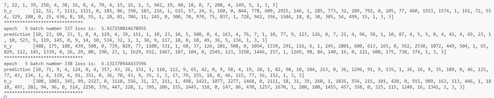

# 循环神经网络(RNN)

## 问题描述：

利用循环神经网络，实现唐诗生成任务。

## 数据集:

唐诗

## 题目要求：

补全程序，主要是前面的3个空和 生成诗歌的一段代码。(tensorflow)   [pytorch 需要补全 对应的 rnn.py 文件中的两处代码]

生成诗歌 开头词汇是 “ 日 、 红 、 山 、 夜 、 湖、 海 、 月 。

参考文献：

    Xingxing Zhang and Mirella Lapata. 2014. Chinese poetry generation with recurrent neural networks. In Proceedings of the 2014 Conference on EMNLP. Association for Computational Linguistics, October

并且参考了这篇博客  https://blog.csdn.net/Irving_zhang/article/details/76664998

## 生成结果

### tf生成结果

日暮，君不得人间事，不得人间不可知。道不知君不得，不知何处到春风。君不是无人事，不是东山不可知。
红蓉畔黏湘畔柳条春雨，花声满树，风吹一枝。来不见，不知此人。之不得，不知何事。之不得，不知何事。
山畔水，一片花声。风吹落，风风。云不见，不知此人。德，不知何事。德，不知有人。
夜向风声。有人间去，何人不可知。君无所见，不见此人间。有无人事，无人不可知。君无所见，不见此人
湖边月落月，风雨满花声。有无人事，何人不可知。君无所见，不见此人间。有无人事，无人不可知。
海上。君不得，不知此人。德，不知何事。德，不知有人。德，不以之之之兮，何事，
月，相思有人，不知何处。君不得，不知何事。之不足，不知何事。之不得，不知何事。之不得，不知何事
春风吹落，风吹落月深。风无处处，山雨落云声。马无人去，无人不可知。君无所见，不见此人间。
冬里。公无事不相思，不得人间不可知。道不知君不得，不知何处到春风。君不是无人事，不是东山不可知。
君子向江头，不得长家得。有一时人，不知人不得。君不可知，不见人间心。然不可见，不得人间心。
公不是三年事，不得人间不可知。君不得人间事，不是东山不可知。道不知君不得，不知何处到春风。

### torch版本生成结果

日西宫，风景阑。
松下无人见，风前不见人。
可怜明月夜，何处不知心。

红树，黄草花开。
独有青云里，清风入夜来。
何当一相见，不觉不成人。

山色，罗列清风，影下无人出。
覆树花初发，清风夜未回。

白云如水合，清影出人迟。

湖节发今，花发一时开。
一夜千门下，千门万里心。
一生皆有主，一日。

明市没，江云出。
貌觉金门下，风前树影中。
更怜池上月，一宿望中回。

朱井头似雾，风景花前一望中。
更有青青池上，不见人云影。

君不知歌舞，更奏将何用。
方知不可见，不觉不成人。

## torch训练截图

torch训练要花费较长时间，因此在非训练目的时直接读取模型参数，下面展示其训练截图

